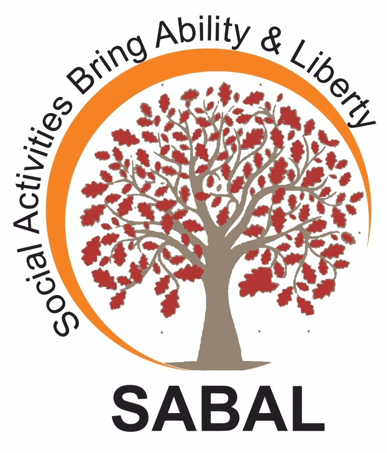

# 🌿 Sabal NGO Website

  

## 🌍 Overview

**Sabal NGO Website** is a modern web application built to showcase the mission, initiatives, and impact of the Sabal NGO.  
The project leverages **Next.js** and **TypeScript** for fast, scalable, and maintainable development, and is **hosted on Vercel** for seamless deployment.

---

## 🚀 Tech Stack

- **Frontend Framework:** Next.js  
- **Language:** TypeScript  
- **Hosting:** Vercel  

## 📦 Deployment
This project is deployed using Vercel.
Any changes pushed to the main branch are automatically deployed to production.

## 🪪 License
This project is licensed under the terms of the MIT License.
See the LICENSE file for details.

## 🧩 Badges

     

## ❤️ Contributing
Contributions are welcome!
If you'd like to improve the project, feel free to open an issue or submit a pull request.

## 📫 Contact
For inquiries or collaboration, please reach out to Sabal NGO.
